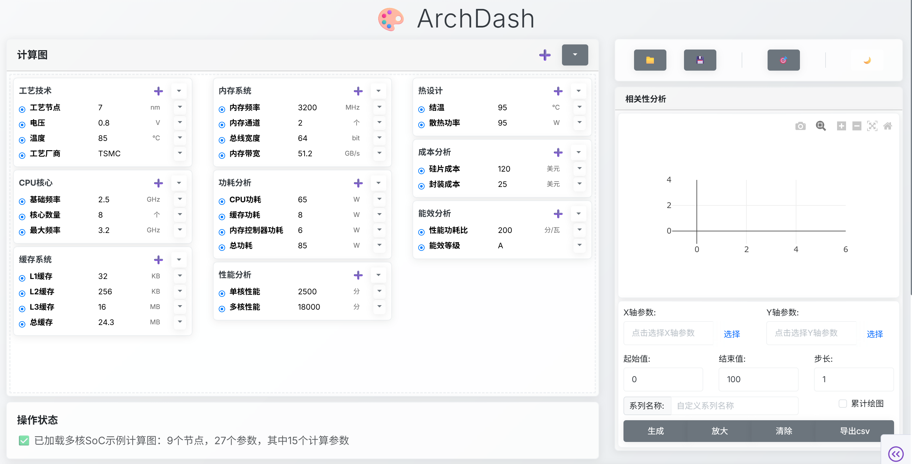

# 参数计算与可视化系统

这是一个基于Python的Web应用，用于可视化配置多组数据，计算复杂中间变量，并展示它们之间的依赖关系。系统支持参数扫描、数据可视化、计算过程追踪和数据导出等功能。



## 主要功能

- 参数配置与验证
- 复杂计算依赖管理
- 实时计算更新
- 参数扫描功能
- 数据可视化（包括VF曲线等）
- 计算过程追踪
- 数据导出到Excel

## 技术栈

- Python 3.8+
- Dash (Web框架)
- Pandas (数据处理)
- Plotly (数据可视化)
- Pytest (测试框架)

## 安装

1. 克隆仓库：
```bash
git clone https://github.com/Readm/ArchDash.git
cd ArchDash
```

2. 安装依赖：
```bash
pip install -r requirements.txt
```

## 运行测试

```bash
pytest test_models.py -v
```

## 项目结构

- `models.py`: 参数和节点类定义
- `app.py`: Web应用主文件
- `scanner.py`: 扫描功能实现
- `plotter.py`: 绘图功能实现
- `test_models.py`: 单元测试文件

## 项目进度

- models.py（参数和节点类定义）已完成
- test_models.py（数据模型测试用例）已完成
- app.py（Web界面）已完成基础功能
  - 参数编辑功能
  - 依赖关系管理
  - 实时计算更新
  - 参数敏感性分析
  - 累计绘图功能
- 布局管理优化已完成
  - 响应式设计
  - 列管理功能
  - 节点位置控制

## 开发状态

当前处于功能完善阶段，已完成：
- 基础数据模型设计
- 参数验证系统
- 计算依赖管理
- 单元测试框架
- Web界面基础功能
- 参数敏感性分析
- 累计绘图功能
- 依赖删除限制
- 布局管理优化

## 下一步计划

- 优化用户界面体验
- 完善数据导出功能
- 添加更多图表类型
- 支持3D参数分析
- 添加批量分析功能
- 实现报告生成功能

## 开发约定

- 每次代码修改后必须执行测试，确保主要功能不被破坏。

## 测试说明

- 运行Dash Web应用测试需要安装Chrome浏览器和ChromeDriver，并确保ChromeDriver在PATH中。
- 安装ChromeDriver后，请确保其可执行文件在系统PATH中，或直接放到项目根目录并赋予执行权限。

## 贡献指南

欢迎提交Issue和Pull Request。请确保遵循以下步骤：

1. Fork 项目
2. 创建特性分支
3. 提交更改
4. 推送到分支
5. 创建Pull Request

## 许可证

MIT License 